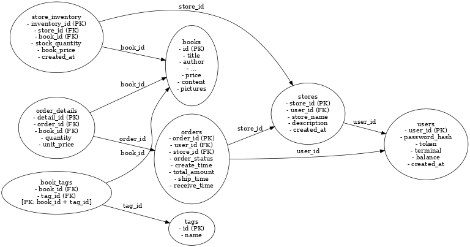

# bookstore大作业报告

##  一、数据库结构设计

### `books`表的迁徙

#### 1. `books` 表

| 字段名             | 类型           | 描述          |
| --------------- | ------------ | ----------- |
| id              | VARCHAR(255) | 图书 ID（主键）   |
| title           | VARCHAR(255) | 图书标题        |
| author          | VARCHAR(255) | 作者          |
| publisher       | VARCHAR(255) | 出版社         |
| original\_title | VARCHAR(255) | 原始标题        |
| translator      | VARCHAR(255) | 译者          |
| pub\_year       | VARCHAR(128) | 出版年份        |
| pages           | INT          | 页数          |
| price           | FLOAT        | 定价          |
| currency\_unit  | VARCHAR(128) | 币种          |
| binding         | VARCHAR(50)  | 装帧类型        |
| isbn            | VARCHAR(50)  | ISBN 编号     |
| author\_intro   | LONGTEXT     | 作者介绍        |
| book\_intro     | LONGTEXT     | 图书简介        |
| content         | LONGTEXT     | 内容摘录        |
| pictures        | LONGBLOB     | 图书封面图片（二进制） |

* 索引：

  * `idx_title`，`idx_author`，`idx_publisher`
  * `FULLTEXT(title, author, publisher, book_intro, content)` 全文索引
  * `FULLTEXT(content)` 全文索引

##### 索引设计

```sql
CREATE INDEX idx_title ON books(title);
CREATE INDEX idx_author ON books(author);
CREATE INDEX idx_publisher ON books(publisher);

ALTER TABLE books 
ADD FULLTEXT idx_fulltext (title, author, publisher, book_intro, content);

ALTER TABLE books 
ADD FULLTEXT idx_content_fulltext (content);
```
* **作用**：集中存储图书元信息及图文详情，方便复用与搜索。

* **索引支持**：
  * 普通索引用于快速定位书名、作者和出版社相关的查询，提升常用字段检索性能。
  * 全文索引用于支持多字段模糊搜索，特别是书籍介绍和内容文本的全文检索，极大提升搜索体验。
  * 复合全文索引（`idx_fulltext`）覆盖多个文本字段，满足复杂的文本搜索需求。
  * 单字段全文索引（`idx_content_fulltext`）专门优化对正文内容的检索效率。
---


#### 2. `tags` 表

| 字段名  | 类型                  | 描述     |
| ---- | ------------------- | ------ |
| id   | INT AUTO\_INCREMENT | 主键     |
| name | VARCHAR(225)        | 标签名，唯一 |
---

* **用途**：存储所有可用的标签名称（如“小说”、“心理学”、“编程”）。
* **设计理由**：

  * 使用独立表确保标签的唯一性与规范性；
  * 便于图书标签搜索等。

---

#### 3. `book_tags` 表（多对多关联表）

| 字段名      | 类型           | 描述        |
| -------- | ------------ | --------- |
| book\_id | VARCHAR(255) | 图书 ID（外键） |
| tag\_id  | INT          | 标签 ID（外键） |

```sql
PRIMARY KEY (book_id, tag_id)  
FOREIGN KEY (book_id) REFERENCES books(id) ON DELETE CASCADE  
FOREIGN KEY (tag_id) REFERENCES tags(id) ON DELETE CASCADE
```

* **用途**：建立图书与标签之间的多对多关系。
* **设计理由**：
  * 一本书可以有多个标签，一个标签也可以对应多本书，这是一个多对多的关系，所以需要单独一张表
  * `ON DELETE CASCADE` 保证删除图书或标签时，关联关系自动清理，保持数据库一致性；
  * 联合主键 `(book_id, tag_id)` 防止重复关联。

* **提升搜索与筛选体验**：通过标签可以支持“按分类浏览”、“标签推荐”等功能；


---
### 书店表的结构

#### 表结构概览

| 表名                  | 用途描述           |
| ------------------- | -------------- |
| `users`             | 存储用户基本信息与余额    |
| `stores`            | 商店信息    |
| `store_inventory`   | 每个商店的图书库存及价格   |
| `orders`            | 用户在商店的订单记录     |
| `order_details`     | 订单中的图书及其数量与单价  |

---

#### 1. `users` 表

| 字段名            | 类型            | 描述           |
| -------------- | ------------- | ------------ |
| user\_id       | VARCHAR(255)  | 用户唯一标识符（主键）  |
| password\_hash | VARCHAR(255)  | 密码哈希         |
| token          | TEXT          | JWT 登录令牌     |
| terminal       | VARCHAR(255)  | 登录终端         |
| balance        | DECIMAL(10,2) | 用户余额，默认 0.00 |
| created\_at    | TIMESTAMP     | 注册时间，默认为当前时间 |

* **作用**：用户信息单独管理，设置余额，实现充值等功能。

---

#### 2. `stores` 表

| 字段名         | 类型           | 描述           |
| ----------- | ------------ | ------------ |
| store\_id   | VARCHAR(255) | 店铺唯一标识符（主键）  |
| user\_id    | VARCHAR(255) | 所属用户 ID（外键）  |
| store\_name | VARCHAR(255) | 店铺名称         |
| description | TEXT         | 店铺描述         |
| created\_at | TIMESTAMP    | 创建时间，默认为当前时间 |

* **作用**：每个用户可创建商店，用户和商店一对多关系，通过外键保持一致性。


#### 3. `store_inventory` 表

| 字段名             | 类型            | 描述           |
| --------------- | ------------- | ------------ |
| inventory\_id   | INT           | 自动递增主键       |
| store\_id       | VARCHAR(255)  | 店铺 ID（外键）    |
| book\_id        | VARCHAR(255)  | 图书 ID（外键）    |
| stock\_quantity | INT           | 库存数量         |
| book\_price     | DECIMAL(10,2) | 售价           |
| created\_at     | TIMESTAMP     | 添加时间，默认为当前时间 |

* 外键约束：

  * `store_id` → `stores(store_id)`
  * `book_id` → `books(id)`
* 联合唯一索引：`UNIQUE (store_id, book_id)`
* **作用**：管理每个商店的库存及定价，避免库存重复、方便更新和商城图书搜索。

---

#### 4. `orders` 表


| 字段名           | 类型             | 描述                   |
| ------------- | -------------- | -------------------- |
| order\_id     | VARCHAR(255)   | 订单 ID（主键）            |
| user\_id      | VARCHAR(255)   | 用户 ID（外键）            |
| store\_id     | VARCHAR(255)   | 店铺 ID（外键）            |
| order\_status | VARCHAR(50)    | 订单状态（pending、paid 等） |
| create\_time  | TIMESTAMP      | 创建时间                 |
| total\_amount | DECIMAL(10,2)  | 总金额                  |
| ship\_time    | TIMESTAMP NULL | 发货时间                 |
| receive\_time | TIMESTAMP NULL | 收货时间                 |

* 外键约束：

  * `user_id` → `users(user_id)`
  * `store_id` → `stores(store_id)`
* 索引：

  * `idx_user_id`, `idx_store_id`, `idx_status`, `idx_order_time`

* **作用**：统一管理订单状态（待支付、已发货、已收货），支持时间戳追踪。

---

#### 5. `order_details` 表

| 字段名         | 类型            | 描述        |
| ----------- | ------------- | --------- |
| detail\_id  | INT           | 自动递增主键    |
| order\_id   | VARCHAR(255)  | 订单 ID（外键） |
| book\_id    | VARCHAR(255)  | 图书 ID（外键） |
| quantity    | INT           | 购买数量      |
| unit\_price | DECIMAL(10,2) | 单价        |

* 外键约束：

  * `order_id` → `orders(order_id)`
  * `book_id` → `books(id)`
* 联合唯一索引：`UNIQUE (order_id, book_id)`

* **作用**：订单与图书多对多关系，拆出详情表方便统计总金额。

---

## 二、事务处理

在项目中，我通过多种方法实现事务处理和数据一致性控制，主要包括以下两种关键技术：

## 1. 事务回滚机制

### 实现方法
- 采用标准的`try-commit-catch-rollback`模式
- 在操作开始前隐式开启事务
- 操作成功后显式提交(commit)
- 出现异常时显式回滚(rollback)

### 代码示例（用户注册）
```python
def register(self, user_id: str, password: str):
    try:
        terminal = f"terminal_{time.time()}"
        token = jwt_encode(user_id, terminal)

        cursor = self.conn.cursor()
        cursor.execute("""
            INSERT INTO users (user_id, password_hash, token, terminal) 
            VALUES (%s, %s, %s, %s)
        """, (user_id, password, token, terminal))
        self.conn.commit()  # 显式提交
    except mysql.connector.Error as e:
        self.conn.rollback()  # 显式回滚
        if e.errno == 1062:  # 处理唯一键冲突
            return error.error_exist_user_id(user_id)
        return 528, str(e)
    except BaseException as e:
        self.conn.rollback()  # 显式回滚
        return 530, str(e)
    return 200, "ok"
```

### 作用
- 确保数据库操作的原子性
- 防止部分更新导致的数据不一致
- 处理并发冲突和系统异常

## 2. 行级锁机制(FOR UPDATE)

### 实现方法
- 在查询时使用`SELECT ... FOR UPDATE`语句
- 锁定查询到的数据行直到事务结束
- 防止其他事务同时修改相同数据

### 代码示例（库存管理）
```python
def add_stock_level(self, user_id: str, store_id: str, book_id: str, add_stock_level: int):
    try:
        cursor = self.conn.cursor()
        # 使用FOR UPDATE锁定库存记录
        cursor.execute("""
            SELECT stock_quantity FROM store_inventory 
            WHERE store_id = %s AND book_id = %s FOR UPDATE
        """, (store_id, book_id))
        
        result = cursor.fetchone()
        if result is None:
            return error.error_non_exist_book_id(book_id)

        current_stock = result[0]
        new_stock = current_stock + add_stock_level
        
        cursor.execute("""
            UPDATE store_inventory SET stock_quantity = %s 
            WHERE store_id = %s AND book_id = %s
        """, (new_stock, store_id, book_id))
        # 提交释放锁
        self.conn.commit()
    except mysql.connector.Error as e:
        self.conn.rollback() # 回滚释放锁
        return 528, str(e)
    except Exception as e:
        self.conn.rollback()
        return 530, str(e)
    return 200, "ok"
```

### 作用
- 保证数据修改的隔离性
- 防止丢失更新和脏读
- 确保库存变更等关键操作的准确性

## 对比总结

| 技术 | 适用场景 | 优点 | 缺点 |
|------|----------|------|------|
| 事务回滚 | 所有数据库写操作 | 保证原子性，简单易用 | 不能解决所有并发问题 |
| FOR UPDATE锁 | 高并发修改场景 | 解决并发冲突，保证隔离性 | 可能引起锁等待，影响性能 |

这两种方法通常结合使用，事务回滚保证操作的原子性，而行级锁保证并发情况下的数据一致性。

---

## 三、新增及优化函数

为了更好的实现功能和提升覆盖率，相较于大作业一，我们在完成本项目的过程中添加了一些新的函数，也优化了一些原有的函数，为我们的bookstore实现更全面的功能。

### 1）seller相关

### 1. `check_store_owner()` 函数
**作用**：验证用户是否为店铺所有者  
**核心功能**：
- 检查指定用户是否拥有指定店铺的所有权
- 用于权限验证的通用工具函数

```python
    def check_store_owner(self, user_id: str, store_id: str) -> bool:
        cursor = self.conn.cursor()
        cursor.execute(
            "SELECT 1 FROM stores WHERE store_id = %s AND user_id = %s",
            (store_id, user_id)
        )
        result = cursor.fetchone()
        cursor.close()
        return result is not None
```

### 2. `change_store_name()` 函数
**作用**：修改店铺名称  
**核心功能**：
- 允许店主修改自己店铺的名称
- 严格的权限验证（必须是店铺所有者）
- 事务安全的数据更新

```python
    def change_store_name(self, user_id: str, store_id: str, new_name: str) -> (int, str):
        try:
            if not self.user_id_exist(user_id):
                return error.error_non_exist_user_id(user_id)
            
            if not self.store_id_exist(store_id):
                return error.error_non_exist_store_id(store_id)
            
            if not self.check_store_owner(user_id, store_id):
                return error.error_authorization_fail()
            
            cursor = self.conn.cursor()
            cursor.execute(
                "UPDATE stores SET store_name = %s "
                "WHERE store_id = %s AND user_id = %s",
                (new_name, store_id, user_id)
            )
            
            if cursor.rowcount == 0:
                cursor.close()
                return error.error_authorization_fail()
            
            self.conn.commit()
            cursor.close()
            return 200, "ok"
        
        except mysql.connector.Error as e:
            self.conn.rollback()
            return 528, f"MySQL error: {str(e)}"
        except Exception as e:
            self.conn.rollback()
            return 530, f"Internal error: {str(e)}"
```

### 3. `get_book_price_and_stock()` 函数
**作用**：查询书籍价格和库存  
**核心功能**：
- 获取指定店铺中特定书籍的价格和库存信息
- 返回结构化数据（字典格式）
- 错误处理机制完善

```python
    def get_book_price_and_stock(self, store_id: str, book_id: str) -> (int, dict):
        try:
            cursor = self.conn.cursor()
            cursor.execute(
                "SELECT stock_quantity, book_price FROM store_inventory WHERE store_id = %s AND book_id = %s",
                (store_id, book_id)
            )
            result = cursor.fetchone()
            cursor.close()

            if result is None:
                # 库存中没有该书
                return 404, f"Book {book_id} not found in store {store_id}"

            stock_quantity, book_price = result
            return 200, {
                "stock_quantity": stock_quantity,
                "book_price": float(book_price)  # 如果price是decimal，转成float方便处理
            }

        except mysql.connector.Error as e:
            return 528, f"MySQL error: {str(e)}"
        except Exception as e:
            return 530, f"Internal error: {str(e)}"
```

### 4. `change_book_price()` 函数
**作用**：修改书籍价格  
**核心功能**：
- 允许店主修改自己店铺中书籍的价格
- 严格的权限验证（必须是店铺所有者）
- 确保书籍存在于店铺中
- 事务安全的数据更新

```python
    def change_book_price(self, user_id: str, store_id: str, book_id: str, new_price: int) -> (int, str):
        try:
            cursor = self.conn.cursor()

            if not self.user_id_exist(user_id):
                return error.error_non_exist_user_id(user_id)

            if not self.store_id_exist(store_id):
                return error.error_non_exist_store_id(store_id)

            cursor.execute(
                "SELECT 1 FROM stores WHERE store_id = %s AND user_id = %s",
                (store_id, user_id)
            )
            if cursor.fetchone() is None:
                return error.error_authorization_fail()

            cursor.execute(
                "SELECT 1 FROM store_inventory WHERE store_id = %s AND book_id = %s",
                (store_id, book_id)
            )
            if cursor.fetchone() is None:
                return error.error_non_exist_book_id(book_id)

            cursor.execute(
                "UPDATE store_inventory SET book_price = %s WHERE store_id = %s AND book_id = %s",
                (new_price, store_id, book_id)
            )

            self.conn.commit()
            cursor.close()
            return 200, "ok"

        except mysql.connector.Error as e:
            self.conn.rollback()
            return 528, f"MySQL error: {str(e)}"
        except Exception as e:
            self.conn.rollback()
            return 530, f"Internal error: {str(e)}"
```

### 5. `add_stock_level()` 函数优化
**优化目的**：原先的测试只是测试了正数的情况，没有考虑到用户如果输入负数的情况，所以优化了添加书籍的逻辑，并增加了测试。
**作用**：修改书籍数量  
**核心功能**：
- 允许店主修改自己店铺中书籍的数量，正数为增加，负数减少，最小为0
- 严格的权限验证（必须是店铺所有者）
- 确保书籍存在于店铺中
- 事务安全的数据更新
```python
    def add_stock_level(self, user_id: str, store_id: str, book_id: str, add_stock_level: int):
        try:
            if not self.user_id_exist(user_id):
                return error.error_non_exist_user_id(user_id)

            if not self.store_id_exist(store_id):
                return error.error_non_exist_store_id(store_id)

            if not self.check_store_owner(user_id, store_id):
                return error.error_authorization_fail()

            cursor = self.conn.cursor()

            cursor.execute(
                "SELECT stock_quantity FROM store_inventory "
                "WHERE store_id = %s AND book_id = %s FOR UPDATE",
                (store_id, book_id)
            )
            result = cursor.fetchone()
            if result is None:
                cursor.close()
                return error.error_non_exist_book_id(book_id)

            current_stock = result[0]
            new_stock = max(0, current_stock + add_stock_level)  # 保证最小为0

            cursor.execute(
                "UPDATE store_inventory SET stock_quantity = %s "
                "WHERE store_id = %s AND book_id = %s",
                (new_stock, store_id, book_id)
            )

            self.conn.commit()
            cursor.close()
            return 200, "ok"

        except mysql.connector.Error as e:
            self.conn.rollback()
            return 528, f"MySQL error: {str(e)}"
        except Exception as e:
            self.conn.rollback()
            return 530, f"Internal error: {str(e)}"
```
### 2）buyer相关

### 1. `order`订单逻辑优化

原有的订单逻辑中，用户在同一家店铺下单时，只能一次性将一批商品加入订单并生成一个订单进行支付。但在实际购物场景中，用户往往会在同一家店铺多次选购商品，这些选购行为应汇总到同一个订单中。

为了更贴近真实业务场景，我们对订单处理逻辑进行了优化：当用户向某家店铺添加商品时，系统会首先判断该用户是否已在该店铺存在一个“未支付”的订单。如果存在，则将新选择的商品追加至该订单中，而非创建新的订单，也算是对订单详情表的一个合理利用。

同时，为了支持订单内容的灵活调整，我们还新增了一个接口，用于减少订单中某类图书的数量，从而实现订单内容的动态管理。
### （1）. `order()` 函数优化
```python
  def new_order(self, user_id: str, store_id: str, id_and_count: List[Tuple[str, int]]) -> Tuple[int, str, str]:
        order_id = ""
        try:
            if not self.user_id_exist(user_id):
                return error.error_non_exist_user_id(user_id) + (order_id,)
            if not self.store_id_exist(store_id):
                return error.error_non_exist_store_id(store_id) + (order_id,)

            with self.conn.cursor() as cursor:
                # Step 1: 查找是否有该用户在该店铺下的未支付订单
                cursor.execute(
                    "SELECT order_id FROM orders "
                    "WHERE user_id = %s AND store_id = %s AND order_status = 'unpaid' FOR UPDATE",
                    (user_id, store_id)
                )
                existing_order = cursor.fetchone()

                if existing_order:
                    order_id = existing_order[0]
                else:
                    # 创建新订单
                    order_id = f"{user_id}_{store_id}_{uuid.uuid1()}"
                    cursor.execute(
                        "INSERT INTO orders (order_id, user_id, store_id, order_status, total_amount) "
                        "VALUES (%s, %s, %s, 'unpaid', 0)",
                        (order_id, user_id, store_id)
                    )

                total_price = Decimal('0.00')

                for book_id, count in id_and_count:
                    cursor.execute(
                        "SELECT stock_quantity, book_price FROM store_inventory "
                        "WHERE store_id = %s AND book_id = %s FOR UPDATE",
                        (store_id, book_id))
                    book = cursor.fetchone()
                    if not book:
                        self.conn.rollback()
                        return error.error_non_exist_book_id(book_id) + (order_id,)

                    stock, price = book
                    if stock < count:
                        self.conn.rollback()
                        return error.error_stock_level_low(book_id) + (order_id,)

                    # 检查该订单中是否已有该书籍
                    cursor.execute(
                        "SELECT quantity FROM order_details "
                        "WHERE order_id = %s AND book_id = %s",
                        (order_id, book_id)
                    )
                    existing_detail = cursor.fetchone()

                    if existing_detail:
                        new_count = existing_detail[0] + count
                        # 更新已有明细
                        cursor.execute(
                            "UPDATE order_details SET quantity = %s WHERE order_id = %s AND book_id = %s",
                            (new_count, order_id, book_id)
                        )
                    else:
                        # 插入新明细
                        cursor.execute(
                            "INSERT INTO order_details (order_id, book_id, quantity, unit_price) "
                            "VALUES (%s, %s, %s, %s)",
                            (order_id, book_id, count, price)
                        )

                    total_price += price * Decimal(count)

                # 更新订单总价
                cursor.execute(
                    "UPDATE orders SET total_amount = total_amount + %s WHERE order_id = %s",
                    (total_price, order_id)
                )

                self.conn.commit()
                return 200, "ok", order_id

        except Exception as e:
            self.conn.rollback()
            logging.error(f"Failed to create or update order: {str(e)}", exc_info=True)
            return 530, f"Internal error: {str(e)}", ""
```
如果用户在某店铺已有未支付订单，则将新商品追加到该订单中；否则新建一个订单。
同时支持：
检查库存是否充足；
如果订单中已存在相同图书，则更新数量；
累计订单总价；

### （2）. `reduce_order_item()` 函数
**作用**：减少订单中特定书籍的数量或移除书籍条目  
**核心功能**：
- 减少未支付订单中的书籍数量
- 自动返还库存（全量或部分）
- 重新计算订单总金额
- 当书籍数量减至0时，从订单中移除该书籍
- 支持订单修改操作

### 代码示例
```python
    def reduce_order_item(self, user_id: str, order_id: str, book_id: str, delta: int) -> Tuple[int, str]:
        try:
            with self.conn.cursor() as cursor:
                # Step 1: 获取订单信息并加锁
                cursor.execute(
                    "SELECT o.user_id, o.store_id, o.order_status, d.quantity, d.unit_price "
                    "FROM orders o "
                    "JOIN order_details d ON o.order_id = d.order_id "
                    "WHERE o.order_id = %s AND d.book_id = %s FOR UPDATE",
                    (order_id, book_id)
                )
                result = cursor.fetchone()
                if not result:
                    return error.error_invalid_order_id(order_id)

                buyer_id, store_id, status, count, price = result

                # Step 2: 校验用户权限和订单状态
                if buyer_id != user_id:
                    return error.error_authorization_fail()
                if status != 'unpaid':
                    return error.error_order_status(order_id)

                # Step 3: 计算新数量
                new_count = count - delta
                if new_count < 0:
                    return 520, "Reduced quantity exceeds current amount"

                if new_count == 0:
                    # Step 4: 删除该条目并返还全部库存
                    cursor.execute(
                        "UPDATE store_inventory SET stock_quantity = stock_quantity + %s "
                        "WHERE store_id = %s AND book_id = %s",
                        (count, store_id, book_id)
                    )

                    cursor.execute(
                        "DELETE FROM order_details WHERE order_id = %s AND book_id = %s",
                        (order_id, book_id)
                    )

                else:
                    # Step 5: 更新数量并返还部分库存
                    cursor.execute(
                        "UPDATE store_inventory SET stock_quantity = stock_quantity + %s "
                        "WHERE store_id = %s AND book_id = %s",
                        (delta, store_id, book_id)
                    )

                    cursor.execute(
                        "UPDATE order_details SET quantity = %s "
                        "WHERE order_id = %s AND book_id = %s",
                        (new_count, order_id, book_id)
                    )

                # Step 6: 更新订单总价（重新计算）
                cursor.execute(
                    "UPDATE orders o SET total_amount = ("
                    "   SELECT COALESCE(SUM(quantity * unit_price), 0) "
                    "   FROM order_details d WHERE d.order_id = o.order_id"
                    ") WHERE o.order_id = %s",
                    (order_id,)
                )

                self.conn.commit()
                return 200, "ok"

        except Exception as e:
            self.conn.rollback()
            logging.error(f"Failed to reduce order item: {str(e)}")
            return 530, f"Internal error: {str(e)}"
```

### 3）store相关
### 1. `column_exists()` 函数
**作用**：检查表中是否存在指定列  
**核心功能**：
- 查询数据库的`information_schema.columns`表
- 检查指定表中是否存在特定列名
- 用于安全地执行表结构变更

```python
    def column_exists(self, cursor, table_name, column_name):
        """Check if a column exists in a table"""
        cursor.execute(f"""
            SELECT COUNT(1) 
            FROM information_schema.columns 
            WHERE table_schema = %s 
            AND table_name = %s 
            AND column_name = %s
        """, (self.database, table_name, column_name))
        return cursor.fetchone()[0] > 0
```

### 2. `index_exists()` 函数
**作用**：检查表中是否存在指定索引  
**核心功能**：
- 查询数据库的`information_schema.statistics`表
- 检查指定表中是否存在特定索引名
- 用于避免重复创建索引

```python
    def index_exists(self, cursor, table_name, index_name):
        """Check if an index exists on a table"""
        cursor.execute(f"""
            SELECT COUNT(1) 
            FROM information_schema.statistics 
            WHERE table_schema = %s 
            AND table_name = %s 
            AND index_name = %s
        """, (self.database, table_name, index_name))
        return cursor.fetchone()[0] > 0

```

### 3. `fulltext_index_exists()` 函数
**作用**：检查表中是否存在指定全文索引  
**核心功能**：
- 查询数据库的`information_schema.statistics`表
- 检查指定表中是否存在特定全文索引名
- 专门用于处理全文索引的检查

```python
    def fulltext_index_exists(self, cursor, table_name, index_name):
        """Check if a fulltext index exists on a table"""
        cursor.execute(f"""
            SELECT COUNT(1) 
            FROM information_schema.statistics 
            WHERE table_schema = %s 
            AND table_name = %s 
            AND index_name = %s
            AND index_type = 'FULLTEXT'
        """, (self.database, table_name, index_name))
        return cursor.fetchone()[0] > 0
```

---

## 四、新增测试
为了测试新增的功能，更好的提高覆盖率，我们编写了新的test case，具体列表如下：
#### 新增测试函数列表

1. **`fe/test/test_add_stock_level.py`** 模块新增的测试函数：
   - `test_ok_decrease_stock`
   - `test_decrease_below_zero`
   - 功能：测试减少库存的各种情况

2. **`test_change_price.py`** 新增模块：
   - `test_error_user_id`
   - `test_error_store_id`
   - `test_error_book_id`
   - `test_ok`
   - 功能：测试修改图书价格的各种情况

3. **`test_create_store.py`** 新增模块：
   - `test_authorization_failure`
   - `test_invalid_store_id`
   - `test_successful_change`
   - `test_empty_store_name`
   - `test_long_store_name`
   - 功能：测试修改店铺名称的各种情况

5. **`test_get_book_price_and_stock.py`** 新增模块：
   - `test_successful_query`
   - `test_book_not_in_store`
   - `test_store_not_exist`
   - `test_after_stock_change`
   - `test_after_price_change`
   - `test_unauthorized_user`
   - 功能：测试查询图书价格和库存的各种情况

6. **`test_new_order.py`** 模块新增的测试函数：
   - `test_append_to_existing_order`
   - `test_cannot_append_to_paid_order`
   - 功能：测试订单追加商品的情况

7. **`test_reduce_order.py`** 新增模块：
   - `test_reduce_order_item_no_error`
   - `test_reduce_order_item_unpaid_order`
   - `test_reduce_order_item_invalid_order_id`
   - `test_reduce_order_item_by_confuse_user`
   - `test_reduce_order_item_exceed_quantity`
   - 功能：测试减少订单商品数量的各种情况

---
## 五、测试程序bug
模块/功能：test_add_stock_level 接口测试用例
问题描述：当前测试仅验证了合法的正整数数量输入，未覆盖负数、零等非法输入情况。
影响：可能导致用户传入非法参数（如 -1）时系统出现不可预期行为（如负库存等）。
优化：修改了add_stock_level函数逻辑，保证库存为正数并且负数处理为减少库存。

## 六、测试结果
在本项目中，所有的test case均通过测试，保证了功能的稳定性，最终覆盖率88%
```bash
(base) ➜  bookstore git:(main) ✗ bash script/test.sh
============================= test session starts ==============================
platform darwin -- Python 3.12.4, pytest-7.4.4, pluggy-1.0.0 -- /opt/anaconda3/bin/python
cachedir: .pytest_cache
rootdir: /Users/shen/Desktop/bookstore
plugins: anyio-4.2.0
collecting ... frontend begin test
 * Serving Flask app 'be.serve' (lazy loading)
 * Environment: production
   WARNING: This is a development server. Do not use it in a production deployment.
   Use a production WSGI server instead.
 * Debug mode: off
2025-06-11 12:08:31,376 [Thread-1 (ru] [INFO ]   * Running on http://127.0.0.1:5000/ (Press CTRL+C to quit)
collected 79 items                                                             

fe/test/test_add_book.py::TestAddBook::test_ok PASSED                    [  1%]
fe/test/test_add_book.py::TestAddBook::test_error_non_exist_store_id PASSED [  2%]
fe/test/test_add_book.py::TestAddBook::test_error_exist_book_id PASSED   [  3%]
fe/test/test_add_book.py::TestAddBook::test_error_non_exist_user_id PASSED [  5%]
fe/test/test_add_funds.py::TestAddFunds::test_ok PASSED                  [  6%]
fe/test/test_add_funds.py::TestAddFunds::test_error_user_id PASSED       [  7%]
fe/test/test_add_funds.py::TestAddFunds::test_error_password PASSED      [  8%]
fe/test/test_add_stock_level.py::TestAddStockLevel::test_ok PASSED       [ 10%]
fe/test/test_add_stock_level.py::TestAddStockLevel::test_error_user_id PASSED [ 11%]
fe/test/test_add_stock_level.py::TestAddStockLevel::test_error_store_id PASSED [ 12%]
fe/test/test_add_stock_level.py::TestAddStockLevel::test_error_book_id PASSED [ 13%]
fe/test/test_add_stock_level.py::TestAddStockLevel::test_ok_decrease_stock PASSED [ 15%]
fe/test/test_add_stock_level.py::TestAddStockLevel::test_decrease_below_zero PASSED [ 16%]
fe/test/test_auto_cancel.py::TestAutoCancelOrder::test_auto_cancel PASSED [ 17%]
fe/test/test_bench.py::test_bench PASSED                                 [ 18%]
fe/test/test_cancel_order.py::TestSend::test_cancel_order_ok PASSED      [ 20%]
fe/test/test_cancel_order.py::TestSend::test_cancel_order_already_paid PASSED [ 21%]
fe/test/test_cancel_order.py::TestSend::test_cancel_order_invalid_order_id PASSED [ 22%]
fe/test/test_cancel_order.py::TestSend::test_confuse_buyer_cannot_cancel_order PASSED [ 24%]
fe/test/test_cancel_order.py::TestSend::test_cancel_order_already_cancelled PASSED [ 25%]
fe/test/test_change_price.py::TestChangeBookPrice::test_error_user_id PASSED [ 26%]
fe/test/test_change_price.py::TestChangeBookPrice::test_error_store_id PASSED [ 27%]
fe/test/test_change_price.py::TestChangeBookPrice::test_error_book_id PASSED [ 29%]
fe/test/test_change_price.py::TestChangeBookPrice::test_ok PASSED        [ 30%]
fe/test/test_create_store.py::TestCreateStore::test_ok PASSED            [ 31%]
fe/test/test_create_store.py::TestCreateStore::test_error_exist_store_id PASSED [ 32%]
fe/test/test_create_store.py::TestChangeStoreName::test_authorization_failure PASSED [ 34%]
fe/test/test_create_store.py::TestChangeStoreName::test_invalid_store_id PASSED [ 35%]
fe/test/test_create_store.py::TestChangeStoreName::test_successful_change PASSED [ 36%]
fe/test/test_create_store.py::TestChangeStoreName::test_empty_store_name PASSED [ 37%]
fe/test/test_create_store.py::TestChangeStoreName::test_long_store_name PASSED [ 39%]
fe/test/test_get_book_price_and_stock.py::TestGetBookPriceAndStock::test_successful_query PASSED [ 40%]
fe/test/test_get_book_price_and_stock.py::TestGetBookPriceAndStock::test_book_not_in_store PASSED [ 41%]
fe/test/test_get_book_price_and_stock.py::TestGetBookPriceAndStock::test_store_not_exist PASSED [ 43%]
fe/test/test_get_book_price_and_stock.py::TestGetBookPriceAndStock::test_after_stock_change PASSED [ 44%]
fe/test/test_get_book_price_and_stock.py::TestGetBookPriceAndStock::test_after_price_change PASSED [ 45%]
fe/test/test_get_book_price_and_stock.py::TestGetBookPriceAndStock::test_unauthorized_user PASSED [ 46%]
fe/test/test_history_order.py::TestReceiveOrder::test_get_order_history_unpaid PASSED [ 48%]
fe/test/test_history_order.py::TestReceiveOrder::test_get_order_history_paid PASSED [ 49%]
fe/test/test_history_order.py::TestReceiveOrder::test_get_order_history_cancelled PASSED [ 50%]
fe/test/test_login.py::TestLogin::test_ok PASSED                         [ 51%]
fe/test/test_login.py::TestLogin::test_error_user_id PASSED              [ 53%]
fe/test/test_login.py::TestLogin::test_error_password PASSED             [ 54%]
fe/test/test_new_order.py::TestNewOrder::test_non_exist_book_id PASSED   [ 55%]
fe/test/test_new_order.py::TestNewOrder::test_low_stock_level PASSED     [ 56%]
fe/test/test_new_order.py::TestNewOrder::test_ok PASSED                  [ 58%]
fe/test/test_new_order.py::TestNewOrder::test_non_exist_user_id PASSED   [ 59%]
fe/test/test_new_order.py::TestNewOrder::test_non_exist_store_id PASSED  [ 60%]
fe/test/test_new_order.py::TestNewOrder::test_append_to_existing_order PASSED [ 62%]
fe/test/test_new_order.py::TestNewOrder::test_cannot_append_to_paid_order PASSED [ 63%]
fe/test/test_password.py::TestPassword::test_ok PASSED                   [ 64%]
fe/test/test_password.py::TestPassword::test_error_password PASSED       [ 65%]
fe/test/test_password.py::TestPassword::test_error_user_id PASSED        [ 67%]
fe/test/test_payment.py::TestPayment::test_ok PASSED                     [ 68%]
fe/test/test_payment.py::TestPayment::test_authorization_error PASSED    [ 69%]
fe/test/test_payment.py::TestPayment::test_not_suff_funds PASSED         [ 70%]
fe/test/test_payment.py::TestPayment::test_repeat_pay PASSED             [ 72%]
fe/test/test_receive_order.py::TestReceiveOrder::test_receive_order_ok PASSED [ 73%]
fe/test/test_receive_order.py::TestReceiveOrder::test_receive_order_non_exist_order_id PASSED [ 74%]
fe/test/test_receive_order.py::TestReceiveOrder::test_receive_order_authorization_fail PASSED [ 75%]
fe/test/test_receive_order.py::TestReceiveOrder::test_receive_order_invalid_order_status PASSED [ 77%]
fe/test/test_reduce_order.py::TestSend::test_reduce_order_item_no_error PASSED [ 78%]
fe/test/test_reduce_order.py::TestSend::test_reduce_order_item_unpaid_order PASSED [ 79%]
fe/test/test_reduce_order.py::TestSend::test_reduce_order_item_invalid_order_id PASSED [ 81%]
fe/test/test_reduce_order.py::TestSend::test_reduce_order_item_by_confuse_user PASSED [ 82%]
fe/test/test_reduce_order.py::TestSend::test_reduce_order_item_exceed_quantity PASSED [ 83%]
fe/test/test_register.py::TestRegister::test_register_ok PASSED          [ 84%]
fe/test/test_register.py::TestRegister::test_unregister_ok PASSED        [ 86%]
fe/test/test_register.py::TestRegister::test_unregister_error_authorization PASSED [ 87%]
fe/test/test_register.py::TestRegister::test_register_error_exist_user_id PASSED [ 88%]
fe/test/test_search.py::TestSearchBooks::test_search_books_by_title PASSED [ 89%]
fe/test/test_search.py::TestSearchBooks::test_search_books_by_tags PASSED [ 91%]
fe/test/test_search.py::TestSearchBooks::test_search_books_by_publisher PASSED [ 92%]
fe/test/test_search.py::TestSearchBooks::test_search_books_global PASSED [ 93%]
fe/test/test_search.py::TestSearchBooks::test_content_search PASSED      [ 94%]
fe/test/test_ship_order.py::TestSend::test_wrong_seller PASSED           [ 96%]
fe/test/test_ship_order.py::TestSend::test_wrong_order PASSED            [ 97%]
fe/test/test_ship_order.py::TestSend::test_wrong_order_state PASSED      [ 98%]
fe/test/test_ship_order.py::TestSend::test_right PASSED                  [100%]

=============================== warnings summary ===============================
../../../../opt/anaconda3/lib/python3.12/site-packages/werkzeug/routing.py:999: 47 warnings
  /opt/anaconda3/lib/python3.12/site-packages/werkzeug/routing.py:999: DeprecationWarning: ast.Str is deprecated and will be removed in Python 3.14; use ast.Constant instead
    parts = parts or [ast.Str("")]

../../../../opt/anaconda3/lib/python3.12/site-packages/werkzeug/routing.py:996: 178 warnings
  /opt/anaconda3/lib/python3.12/site-packages/werkzeug/routing.py:996: DeprecationWarning: ast.Str is deprecated and will be removed in Python 3.14; use ast.Constant instead
    _convert(elem) if is_dynamic else ast.Str(s=elem)

../../../../opt/anaconda3/lib/python3.12/ast.py:587: 178 warnings
  /opt/anaconda3/lib/python3.12/ast.py:587: DeprecationWarning: Attribute s is deprecated and will be removed in Python 3.14; use value instead
    return Constant(*args, **kwargs)

../../../../opt/anaconda3/lib/python3.12/site-packages/werkzeug/routing.py:1003: 266 warnings
  /opt/anaconda3/lib/python3.12/site-packages/werkzeug/routing.py:1003: DeprecationWarning: ast.Str is deprecated and will be removed in Python 3.14; use ast.Constant instead
    if isinstance(p, ast.Str) and isinstance(ret[-1], ast.Str):

../../../../opt/anaconda3/lib/python3.12/site-packages/werkzeug/routing.py:1004: 264 warnings
  /opt/anaconda3/lib/python3.12/site-packages/werkzeug/routing.py:1004: DeprecationWarning: Attribute s is deprecated and will be removed in Python 3.14; use value instead
    ret[-1] = ast.Str(ret[-1].s + p.s)

../../../../opt/anaconda3/lib/python3.12/site-packages/werkzeug/routing.py:1004: 132 warnings
  /opt/anaconda3/lib/python3.12/site-packages/werkzeug/routing.py:1004: DeprecationWarning: ast.Str is deprecated and will be removed in Python 3.14; use ast.Constant instead
    ret[-1] = ast.Str(ret[-1].s + p.s)

fe/test/test_login.py::TestLogin::test_ok
fe/test/test_password.py::TestPassword::test_ok
  /opt/anaconda3/lib/python3.12/site-packages/jwt/api_jwt.py:125: DeprecationWarning: datetime.datetime.utcnow() is deprecated and scheduled for removal in a future version. Use timezone-aware objects to represent datetimes in UTC: datetime.datetime.now(datetime.UTC).
    now = timegm(datetime.utcnow().utctimetuple())

-- Docs: https://docs.pytest.org/en/stable/how-to/capture-warnings.html
================ 79 passed, 1067 warnings in 1814.03s (0:30:14) ================
/Users/shen/Desktop/bookstore/be/serve.py:20: UserWarning: The 'environ['werkzeug.server.shutdown']' function is deprecated and will be removed in Werkzeug 2.1.
  func()
2025-06-11 12:38:41,105 [Thread-12351] [INFO ]  127.0.0.1 - - [11/Jun/2025 12:38:41] "GET /shutdown HTTP/1.1" 200 -
frontend end test
No data to combine
Name                                       Stmts   Miss Branch BrPart  Cover
----------------------------------------------------------------------------
be/__init__.py                                 0      0      0      0   100%
be/app.py                                      3      3      2      0     0%
be/model/__init__.py                           0      0      0      0   100%
be/model/buyer.py                            330     70    100     17    79%
be/model/db_conn.py                           27      3      0      0    89%
be/model/error.py                             27      2      0      0    93%
be/model/seller.py                           179     55     48      9    72%
be/model/store.py                            101     39     16      8    60%
be/model/user.py                             154     49     32      7    70%
be/serve.py                                   41      1      2      1    95%
be/view/__init__.py                            0      0      0      0   100%
be/view/auth.py                               42      0      0      0   100%
be/view/buyer.py                             122     20     28     11    79%
be/view/seller.py                             67      0      4      0   100%
fe/__init__.py                                 0      0      0      0   100%
fe/access/__init__.py                          0      0      0      0   100%
fe/access/auth.py                             31      0      0      0   100%
fe/access/book.py                             67      2      4      1    96%
fe/access/buyer.py                           117     21     12      4    81%
fe/access/new_buyer.py                         8      0      0      0   100%
fe/access/new_seller.py                        8      0      0      0   100%
fe/access/seller.py                           83     15      6      0    81%
fe/bench/__init__.py                           0      0      0      0   100%
fe/bench/run.py                               13      0      6      0   100%
fe/bench/session.py                           49      1     14      2    95%
fe/bench/workload.py                         128      4     24      4    95%
fe/conf.py                                    11      0      0      0   100%
fe/conftest.py                                19      0      0      0   100%
fe/test/gen_book_data.py                      49      0     16      1    98%
fe/test/test_add_book.py                      37      0     10      0   100%
fe/test/test_add_funds.py                     23      0      0      0   100%
fe/test/test_add_stock_level.py               90      0     14      0   100%
fe/test/test_auto_cancel.py                   43      1      4      1    96%
fe/test/test_bench.py                          6      2      0      0    67%
fe/test/test_cancel_order.py                  72      0      4      1    99%
fe/test/test_change_price.py                  42      0      0      0   100%
fe/test/test_create_store.py                  62      0      0      0   100%
fe/test/test_get_book_price_and_stock.py     100      0      6      0   100%
fe/test/test_history_order.py                 64      1      8      2    96%
fe/test/test_login.py                         28      0      0      0   100%
fe/test/test_new_order.py                     74      0      0      0   100%
fe/test/test_password.py                      33      0      0      0   100%
fe/test/test_payment.py                       60      1      4      1    97%
fe/test/test_receive_order.py                 79      1      4      1    98%
fe/test/test_reduce_order.py                  80      0      4      1    99%
fe/test/test_register.py                      31      0      0      0   100%
fe/test/test_search.py                        70      0      0      0   100%
fe/test/test_ship_order.py                    74      1      4      1    97%
----------------------------------------------------------------------------
TOTAL                                       2744    292    376     73    88%
Wrote HTML report to htmlcov/index.html
```
---

## 六、成员分工
| 学号      | 姓名  | 分工                                                         |
|-----------|-------|--------------------------------------------------------------|
| 10235501465 | 宋琪语  | 1. 负责从MongoDB到MySQL的数据库迁移设计和实现。<br>2. 负责设计并实现关系型数据库schema。<br>3. 负责添加事务处理机制（事务回滚和行级锁）确保数据一致性。<br>4. 负责实现部分新增功能和对应测试。<br>5. 负责撰写报告的数据库结构设计和事务处理部分。|
| 10235501458 | 沈思妤  | 1. 负责功能扩展，实现了项目新增功能的对应测试文件与实现代码。<br>2. 负责修改添加合理的接口，扩展并优化了项目的接口设计。<br>3. 负责整体代码的集成、调试和优化，测试并提升了项目整体覆盖率。<br>4. 负责实施测试驱动开发流程和版本控制管理。<br>5. 负责撰写报告新增功能和亮点等其余部分并整合全文。|

---

## 七、项目亮点

#### 1. 数据库架构升级与优化

- **迁移至关系型数据库**：将核心数据从文档型数据库MongoDB迁移至关系型数据库MySQL，利用关系模型的优势：

- 通过外键约束保证数据一致性（如店铺与库存的级联删除）

- 事务支持确保支付、库存变更等操作的原子性

- 复杂查询性能提升

- **智能表结构管理**：在`store.py`中实现：

- 动态检查表结构变更

- 索引优化机制，避免重复创建索引，自动补充缺失索引

### 2. 全面的测试覆盖

- **测试用例创新**：
  - 新增多个测试模块，共79个，覆盖所有接口
  - 边界测试：测试了库存减至负数、超长店铺名称等少见情况
  - 状态流转测试：订单状态机(unpaid→paid→shipped→completed)
  
- **覆盖率成果**：
  ```bash
  TOTAL      2744    292    376     73    88%
  ```
代码覆盖率达到了88%。 

### 3. 使用正确的软件工程方法及工具

- **使用Git版本控制管理**：
  - 用 Git 作为版本管理工具，对项目代码进行了有效的管理，采用GitHub协助开发，团队能够更好的沟通合作，保障了代码质量和开发效率。同时，使用 Git 的提交记录可以方便地追溯代码的修改历史，便于团队协作和问题排查。

- **测试驱动开发**：
  - 在开发过程中，为了更好的实现项目，在构思好需要添加或修改的功能后，先写测试代码再实现功能代码

### 4. 功能扩展与体验优化

- **订单灵活性增强**：
  - 实现`reduce_order_item`支持修改未支付订单
  - 解决"购物车"式分批下单需求

- **店铺管理功能完善**：
  - 新增店铺名称修改、图书价格调整功能
  - 对用户有着严格且全面的权限验证

### 5. 项目ER图直观展示


---

## 八. 项目总结

本次项目使用MySQL数据库，实现了一个涵盖用户注册、店铺管理、商品上架、库存维护、下单支付与订单发货等功能的系统。  
项目不仅支持了基础的书店交易流程，还拓展了如图书标签体系、库存调整、价格修改等实际业务需求。在数据库设计方面，项目遵循规范，构建了清晰的实体关系模型，确保了数据的完整性与可扩展性。
同时，测试用例使用 pytest 编写，保障了关键业务逻辑的正确性与稳定性。  
通过本项目，我们不仅掌握了完整的后端开发流程和接口调试方法，也加深了对数据库建模、接口安全、用户行为模拟等开发技术的理解。

代码仓库为：
https://github.com/shen147258369/bookstore.git 